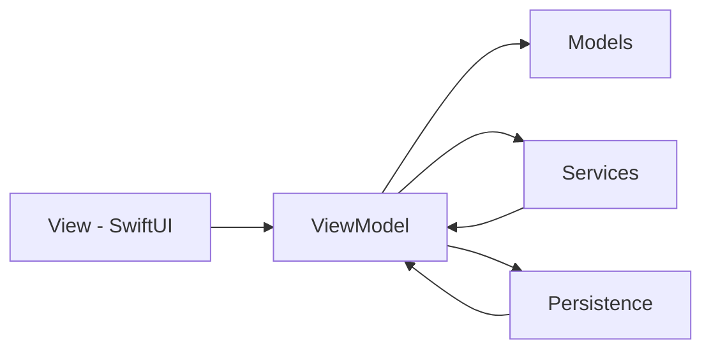
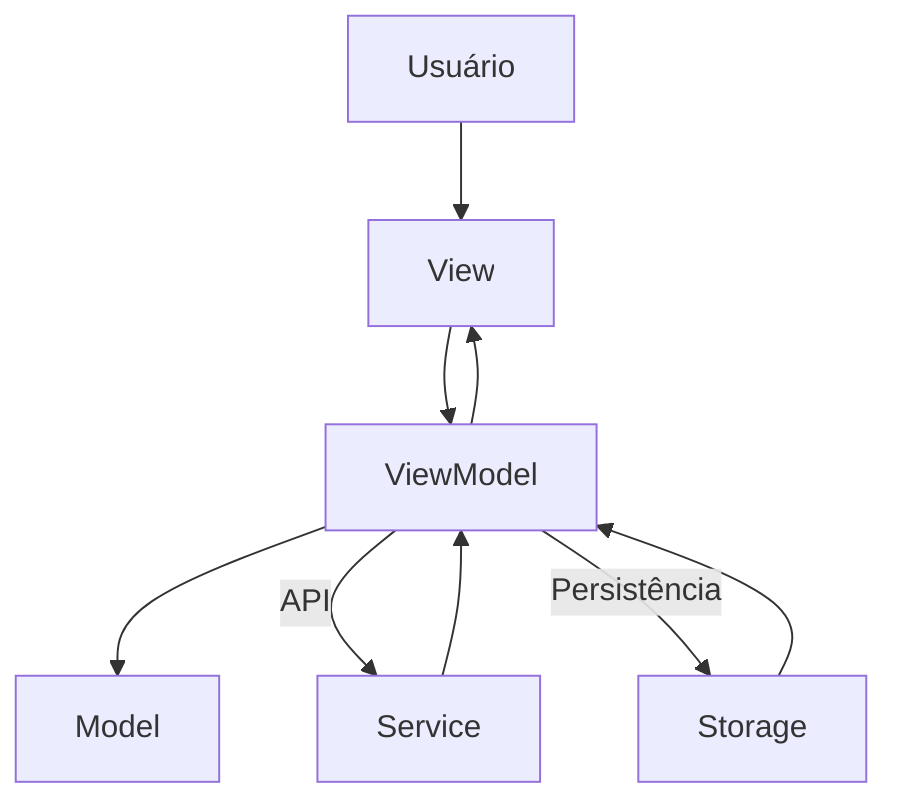
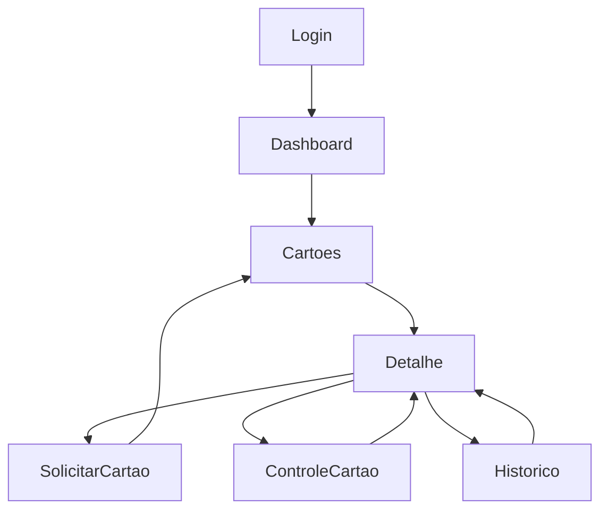

# 💳 CardControl

Controle seus cartões, acompanhe seus gastos e mantenha sua vida financeira organizada em um único lugar

---

## ✨ Visão Geral

O CardControl é um aplicativo iOS desenvolvido em SwiftUI que permite gerenciar cartões de crédito, acompanhar despesas e visualizar indicadores financeiros de forma simples e intuitiva.

O projeto foi criado com foco em experiência do usuário, arquitetura limpa e boas práticas de desenvolvimento iOS.

Além disso, o projeto foi desenvolvido como um **MVP funcional**, aplicando conceitos essenciais de arquitetura e organização de código.

---

## 🚀 Principais Recursos

* 🔐 Login com Google
* 💳 Cadastro de cartões de crédito
* 📊 Dashboard financeiro
* 💸 Controle de gastos por cartão
* 📈 Limite utilizado e disponível
* 🕒 Histórico de transações
* ☁️ Integração com Firebase Authentication
* 📱 Interface moderna em SwiftUI

---

## 🏗️ Arquitetura

O projeto segue o padrão **MVVM (Model-View-ViewModel)**.

    Views
     ↓
    ViewModels
     ↓
    Services
     ↓
    Persistence (Core Data)

### Estrutura

    CardControl
    ├── Models
    ├── Views
    ├── ViewModels
    ├── Services
    ├── Persistence
    └── Resources

---

## 📊 Diagrama de Arquitetura

---

## 🔄 Fluxo de Dados

---

## 📱 Fluxo do Aplicativo

---

## 🛠️ Tecnologias

| Tecnologia     | Finalidade              |
| -------------- | ----------------------- |
| SwiftUI        | Interface               |
| MVVM           | Arquitetura             |
| Firebase Auth  | Autenticação            |
| Google Sign-In | Login                   |
| Core Data      | Persistência            |
| Combine        | Gerenciamento de estado |

---

## ⚙️ Tecnologias Complementares

- URLSession (simulação/consumo de API)
- Codable (tratamento de dados)
- NavigationStack (navegação)
- Async/Await (operações assíncronas)

---

## 📱 Principais Telas

### Splash Screen
Tela inicial da aplicação.

### Login
Autenticação segura utilizando conta Google.

### Dashboard
Resumo financeiro consolidado.

### Cartões
Gerenciamento completo dos cartões cadastrados.

### Histórico
Consulta de movimentações e despesas.

### Funcionalidades adicionais (MVP)

- Solicitação de cartão
- Bloqueio e desbloqueio
- Alteração de limite
- Visualização de compras

---

## 🌐 API

- Uso de API mock/simulada
- Simulação de chamadas assíncronas
- Tratamento de estados:
  - ⏳ Loading
  - ✅ Sucesso
  - ❌ Erro
  - 📭 Vazio

---

## 💾 Persistência

- Armazenamento local de cartões e alterações
- Simulação de persistência com CoreData/UserDefaults
- Mantém dados após fechar o app

---

## 🔒 Segurança

A autenticação é realizada através do Firebase Authentication utilizando Google Sign-In.

Nenhuma senha é armazenada localmente pelo aplicativo.

---

## 🎯 Objetivos do Projeto

* Aplicar conceitos de SwiftUI
* Utilizar arquitetura MVVM
* Integrar autenticação com Firebase
* Implementar persistência com Core Data
* Construir uma experiência moderna para controle financeiro

---

## 🚀 Deploy e Execução

### ▶️ Execução local

    git clone https://github.com/epilldev/CardControl.git

Abrir no Xcode, selecionar um simulador e executar com:

    ⌘ + R

---

### 📱 Execução em dispositivo físico

1. Conectar um iPhone ao Mac  
2. Configurar Apple ID no Xcode  
3. Ativar "Automatically manage signing"  
4. Executar no dispositivo  

---

### ☁️ Deploy (App Store / TestFlight)

Projeto em estágio MVP — deploy completo ainda em evolução

1. Product → Archive no Xcode  
2. Enviar para App Store Connect  
3. Publicar via TestFlight ou App Store  

---

## 🎯 Diferencial do Projeto

- Simulação de uso real de cartões
- Fluxo completo (criação → controle → histórico)
- Arquitetura organizada (MVVM)
- Base pronta para evolução

---

## ✅ Status do Projeto por Integrante

> ✅ Concluído | ⏳ Em andamento

---

### 👤 Fábio — Base do projeto / Arquitetura

- ✅ Criar projeto SwiftUI  
- ✅ Estrutura MVVM  
- ✅ NavigationStack  
- ✅ Pastas: Models, Views, ViewModels, Services, Repositories  
- ✅ Criar rotas principais  

---

### 👤 Thiego — API / Dados

- ✅ Buscar lista de cartões e compras  

- ✅ Criar mock/API de cartões  
- ✅ URLSession  
- ✅ Codable  
- ✅ Tratamento de loading, erro e sucesso  

---

### 👤 Felipe — Persistência local

- ✅ Salvar ações simuladas (bloqueio, alteração de limite, solicitação)  
- ✅ Usar CoreData ou cache local  
- ✅ Salvar cartões favoritos  

---

### 👤 Camila — Telas principais

- ✅ Tela de Login  
- ✅ Home / lista de cartões  
- ✅ Tela de detalhes do cartão  
- ✅ Layout visual do cartão virtual  

---

### 👤 Vani — Fluxos e apresentação

- ✅ Tela de compras / histórico  

- ✅ Tela de solicitar cartão  
- ✅ Tela de bloquear / alterar limite  
- ✅ README  
- ✅ Roteiro da apresentação  

---
``

## ⚠️ Desafios e Erros Encontrados

- Integração entre telas e navegação  
- Persistência ainda em evolução  
- Tratamento de estados da API  
- Estruturação inicial do MVVM  
- Bugs na tela 

---

## 🔜 Melhorias Futuras - Concluídas

- Integração com API real  
- Implementar CoreData completo  
- Autenticação real com Firebase  
- Melhorias de UX/UI  
- Gráficos financeiros  

---

## 📌 Considerações Finais

O projeto representa a aplicação prática de conceitos fundamentais do desenvolvimento iOS moderno, incluindo:

- SwiftUI  
- MVVM  
- Navegação estruturada  
- Persistência de dados  

Servindo como base para evolução futura de um aplicativo real de gestão financeira.

---
